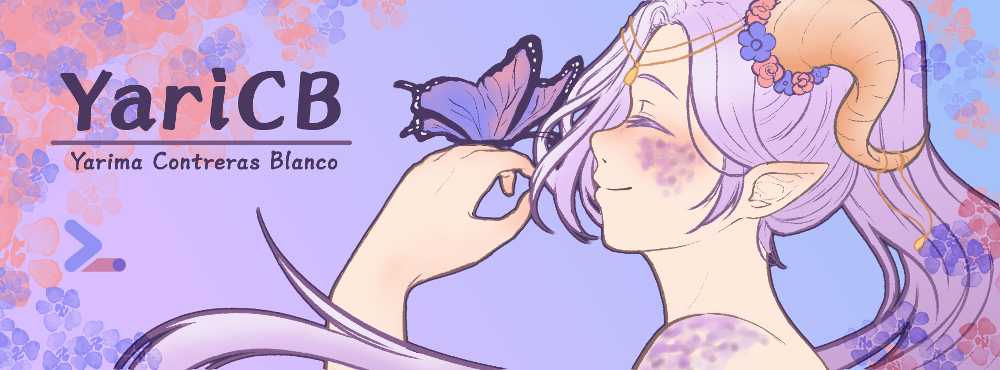

  

# ¡Hola, soy Yarima Contreras Blanco! 🎨💻
Estudiante de Computación UCV | Ilustradora | Frontend & UI

## 🌸 Sobre mí

Estudiante de Licenciatura en Computación con talento creativo desarrollado en ilustración. Interesada en la creación de experiencias visualmente atractivas y funcionales, la representación de imágenes y animación; así como en el mundo de los datos, su procesamiento y análisis.

📚 Preparadora de Matemáticas Discretas I desde abril de 2024.  
🖊 Auxiliar Docente de la Escuela de Computación UCV.

## 💻 Stack Tecnológico

### 🎓 Academia

### 💻 Desarrollo
**Frontend & Web Design**  

**Backend & Lenguajes**  

**Bases de Datos & BI**  

### 🎨 Diseño & Ilustración

<!-- ## 📊 Estadísticas de GitHub

  
  

 -->

## 📫 Contáctame

)

